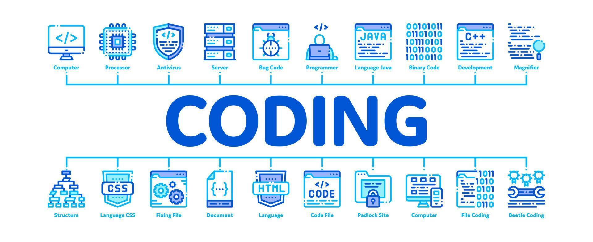

<h1 align="center">Hi 👋, I'm yaswanth</h1>
<h3 align="center">Interested in learning New Technology's</h3>

  

- 🔭 I’m currently working on <a href='https://sanityhub.vercel.app/' target="_blank">SanityHub Mini Cloud ☁️ Storage</a>

- 🌱 I’m currently learning **DSA with JS,React Native**

- ✅ Checkout my portfolio <a href='https://yash5800.github.io/R3F_Portfolio/' target="_blank">Lookout</a>

- 💬 Ask me about **Web Applications**

- 📫 How to reach me **yaswanthjk580@gmai.com**

<h3 align="left">Connect with me:</h3>

<h3 align="left">Languages and Tools:</h3>

                    

 
